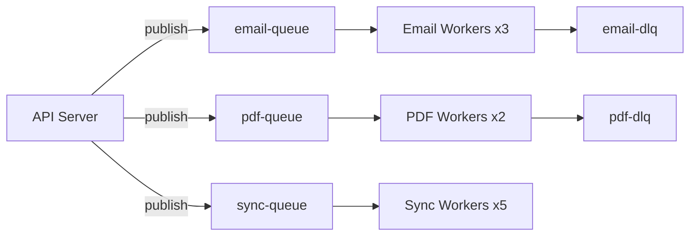

# Worker Service Design

> Design a background worker service architecture for processing asynchronous tasks, long-running operations, and scheduled workloads.

## Metadata
- **Category:** `background-processing`
- **Complexity:** `intermediate`

## Context

- **Use case:** Offloading work from the request–response path to background workers.
- **Prerequisites:** Identified tasks that can be processed asynchronously, message broker or queue selection.
- **Scope:** Worker topology, task dispatch, error handling, scaling. Does not cover message broker infrastructure setup.

## Prompt

```text
<Role>
You are a backend architect specializing in distributed background processing systems.

<Context>
- System: {{SYSTEM_NAME}}
- Task types: {{TASK_TYPES}} (e.g., email sending, PDF generation, data import, image processing)
- Volume: {{TASK_VOLUME}} tasks/day
- SLA: {{SLA}} (max acceptable processing latency)
- Infrastructure: {{INFRA}} (Kubernetes / VMs / serverless / managed service)
- Queue/broker: {{BROKER}} (RabbitMQ / SQS / Kafka / Redis / Azure Service Bus)

<Task>
Design a worker service architecture covering:

### 1. Task Classification
| Class | Priority | Latency Target | Retry | Example |
|-------|----------|----------------|-------|---------|
| Critical | P0 | < 30s | 5x exponential | Payment confirmation |
| Standard | P1 | < 5min | 3x exponential | Email notification |
| Bulk | P2 | < 1h | 2x linear | Report generation |
| Deferred | P3 | Best effort | 1x | Analytics aggregation |

### 2. Worker Topology
- Worker pool sizing and scaling strategy
- Queue-per-task-type vs. shared queue with routing
- Competing consumers pattern
- Worker specialization vs. generalization
- Concurrency model (thread pool / process pool / async)

### 3. Task Dispatch
- Message format and schema (envelope pattern)
- Idempotency key generation
- Priority queuing
- Deduplication strategy
- Delayed / scheduled dispatch

### 4. Reliability Patterns
- At-least-once delivery guarantee
- Idempotent task handlers
- Dead letter queue (DLQ) configuration
- Poison message detection
- Circuit breaker for downstream dependencies
- Checkpoint / resume for long-running tasks

### 5. Error Handling & Retry
- Retry strategy per task class (exponential backoff with jitter)
- Max retry count and DLQ routing
- Error categorization (transient vs. permanent)
- Alerting thresholds (DLQ depth, processing latency)
- Manual retry / replay tooling

### 6. Scaling
- Horizontal scaling triggers (queue depth, processing lag)
- Autoscaling configuration (HPA / KEDA / custom)
- Graceful shutdown and in-flight task completion
- Rate limiting and backpressure

### 7. Observability
- Metrics: queue depth, processing rate, latency percentiles, error rate
- Distributed tracing (correlate task with originating request)
- Structured logging per task lifecycle
- Dashboard design

### 8. Data Flow Diagram
Provide a Mermaid diagram showing: Producer → Queue → Worker → Result Store → Notification.

<Constraints>
- Workers must handle graceful shutdown (complete in-flight tasks)
- All tasks must be idempotent
- DLQ must be monitored with alerting
- Task payload must not contain PII in plain text

<Output Format>
Structured markdown with topology diagram (Mermaid), task classification table, retry configuration, scaling rules, and code structure.
```

## Variables

| Variable | Required | Description | Example |
|----------|----------|-------------|---------|
| `{{SYSTEM_NAME}}` | Yes | System name | `OrderProcessor` |
| `{{TASK_TYPES}}` | Yes | Types of background tasks | `email, PDF, data sync` |
| `{{TASK_VOLUME}}` | Yes | Daily volume | `500,000/day` |
| `{{SLA}}` | No | Latency requirement | `< 5min for standard` |
| `{{INFRA}}` | No | Infrastructure platform | `Kubernetes` |
| `{{BROKER}}` | No | Message broker | `RabbitMQ` |

## Example Output

```markdown
## Worker Architecture: OrderProcessor

### Topology


### Retry Configuration
| Task | Max Retries | Backoff | DLQ After |
|------|------------|---------|-----------|
| Email | 5 | Exponential (1s, 2s, 4s, 8s, 16s) | 5 failures |
| PDF | 3 | Exponential (5s, 25s, 125s) | 3 failures |
| Sync | 3 | Linear (30s, 60s, 90s) | 3 failures |
```

## Composition

- **Precedes:** `devops-monitoring-observability`, `devops-containerization`
- **Follows:** `arch-event-driven-architecture`, `system-high-level-design`
- **Combines with:** `bg-job-scheduling`, `bg-message-consumer-design`
- **Overlay:** `overlays/dotnet/`, `overlays/node/`, `overlays/python/`, `overlays/java/`

## Tips & Variations

- **For serverless:** Use AWS Lambda + SQS or Azure Functions + Service Bus for auto-scaling workers.
- **For Kubernetes:** Use KEDA for queue-based autoscaling (scale to zero).
- **For .NET:** Use `IHostedService` / `BackgroundService` with channel-based pipeline.
