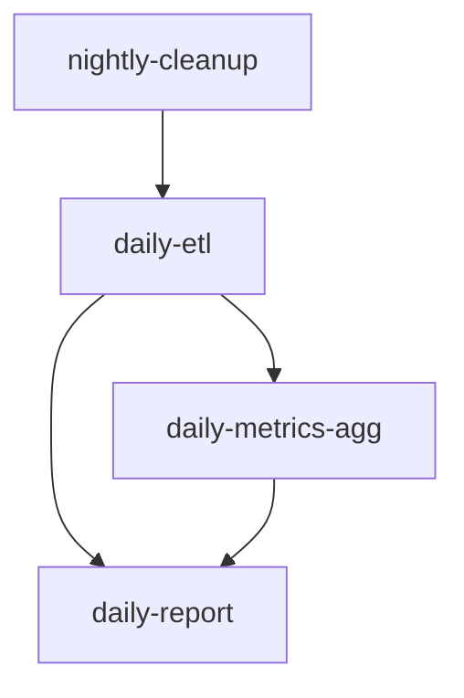

# Job Scheduling

> Design a job scheduling system for recurring tasks, batch operations, and time-triggered workloads.

## Metadata
- **Category:** `background-processing`
- **Complexity:** `intermediate`

## Context

- **Use case:** Running periodic tasks (reports, cleanups, syncs) or scheduled one-off jobs.
- **Prerequisites:** Identified recurring workloads, infrastructure for running jobs.
- **Scope:** Scheduling, execution guarantees, concurrency control, monitoring. Does not cover the internal logic of individual jobs.

## Prompt

```text
<Role>
You are a backend engineer specializing in distributed job scheduling and batch processing systems.

<Context>
- System: {{SYSTEM_NAME}}
- Job types: {{JOB_TYPES}} (e.g., daily report, hourly sync, nightly cleanup, ad-hoc data migration)
- Total scheduled jobs: {{JOB_COUNT}}
- Infrastructure: {{INFRA}} (Kubernetes CronJob / Hangfire / Quartz / Celery Beat / Cloud Scheduler)
- Time zones: {{TIMEZONES}} (single / multiple)

<Task>
Design a job scheduling architecture covering:

### 1. Job Registry
| Job ID | Schedule | Type | Timeout | Concurrency | Owner |
|--------|----------|------|---------|-------------|-------|
| daily-report | 0 6 * * * | Recurring | 30min | 1 (no overlap) | Analytics |
| hourly-sync | 0 * * * * | Recurring | 10min | 1 | Integration |
| nightly-cleanup | 0 2 * * * | Recurring | 2h | 1 | Platform |
| ad-hoc-migration | Manual trigger | One-off | 4h | 1 | DBA |

### 2. Scheduling Infrastructure
- Scheduler selection and justification
- Cron expression management (centralized config)
- Time zone handling strategy
- DST (Daylight Saving Time) edge cases
- Scheduler high-availability (leader election)

### 3. Execution Guarantees
- At-most-once vs. at-least-once execution
- Distributed locking to prevent overlapping runs
- Job instance tracking (run ID, start/end, status)
- Missed schedule detection and catch-up policy
- Graceful cancellation support

### 4. Concurrency & Dependency
- Job dependency graph (Job B runs after Job A completes)
- Parallel job execution limits
- Resource contention management
- Priority-based scheduling when resources are constrained

### 5. Error Handling
- Per-job retry policy
- Failure notification (Slack, email, PagerDuty)
- Partial failure handling for batch jobs (checkpoint/resume)
- Dead job detection (stuck/hung jobs)
- Manual re-run capability

### 6. Observability
- Job execution dashboard (Gantt chart view)
- Metrics: success rate, duration trend, queue wait time
- Alerting: failed jobs, long-running jobs, missed schedules
- Audit log of all schedule changes

### 7. Security
- Job execution permissions (RBAC)
- Secrets injection for jobs (not in schedule config)
- Network isolation for jobs accessing sensitive data
- Audit trail for ad-hoc job triggers

<Constraints>
- No two instances of the same job may run concurrently (unless explicitly configured)
- All job executions must be logged with duration and outcome
- Schedule changes must go through version-controlled config
- Jobs must support graceful shutdown signals

<Output Format>
Structured markdown with job registry table, dependency DAG (Mermaid), infrastructure diagram, and alerting rules.
```

## Variables

| Variable | Required | Description | Example |
|----------|----------|-------------|---------|
| `{{SYSTEM_NAME}}` | Yes | System name | `DataPlatform` |
| `{{JOB_TYPES}}` | Yes | Types of scheduled jobs | `daily report, hourly ETL, nightly cleanup` |
| `{{JOB_COUNT}}` | No | Number of scheduled jobs | `25` |
| `{{INFRA}}` | No | Scheduler platform | `Kubernetes CronJob + custom orchestrator` |
| `{{TIMEZONES}}` | No | Time zone requirements | `US/Eastern + UTC` |

## Example Output

```markdown
## Job Schedule: DataPlatform

### Dependency DAG


### Locking Strategy
- Redis-based distributed lock per job ID
- Lock TTL = job timeout + 5min buffer
- Lock key: `job-lock:{job-id}`
- Heartbeat every 30s to extend lock
```

## Composition

- **Precedes:** `devops-monitoring-observability`
- **Follows:** `bg-worker-service-design`
- **Combines with:** `db-query-optimization`, `devops-containerization`
- **Overlay:** `overlays/dotnet/`, `overlays/node/`, `overlays/python/`, `overlays/java/`

## Tips & Variations

- **For Kubernetes:** Use CronJob resources with `concurrencyPolicy: Forbid` for simple cases; add a custom controller for dependencies.
- **For .NET:** Hangfire provides an excellent dashboard and recurring job management.
- **For Python:** Celery Beat + Redis is a popular choice; APScheduler for simpler needs.
