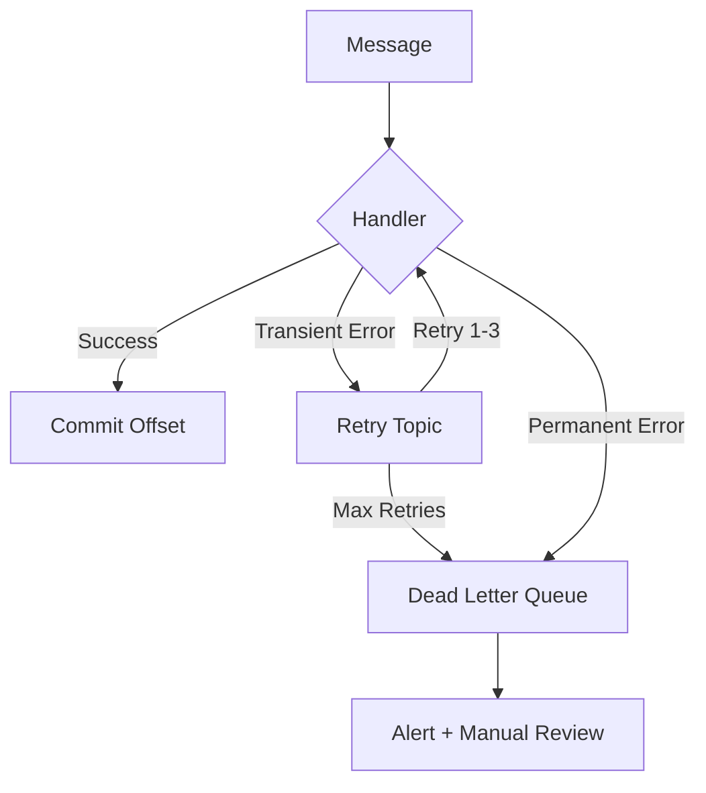

# Message Consumer Design

> Design robust message consumer services for event-driven architectures with delivery guarantees, ordering, and exactly-once processing semantics.

## Metadata
- **Category:** `background-processing`
- **Complexity:** `advanced`

## Context

- **Use case:** Building consumers for event streams or message queues in distributed systems.
- **Prerequisites:** Event-driven architecture design, chosen message broker.
- **Scope:** Consumer patterns, delivery semantics, error handling, scaling. Does not cover producer design or broker infrastructure.

## Prompt

```text
<Role>
You are a distributed systems engineer specializing in message-driven architectures and stream processing.

<Context>
- System: {{SYSTEM_NAME}}
- Broker: {{BROKER}} (Kafka / RabbitMQ / Azure Service Bus / AWS SQS+SNS / Google Pub/Sub)
- Message volume: {{VOLUME}} messages/second
- Ordering requirement: {{ORDERING}} (none / per-key / total)
- Processing guarantee: {{GUARANTEE}} (at-most-once / at-least-once / exactly-once)
- Consumer count: {{CONSUMERS}} consumer services

<Task>
Design a message consumer architecture covering:

### 1. Consumer Topology
- Consumer group strategy
- Partition/queue assignment
- Consumer instance count and scaling policy
- Co-located vs. dedicated consumer services

### 2. Message Processing Patterns
| Pattern | Use Case | Complexity |
|---------|----------|-----------|
| Simple Consumer | Process one message at a time | Low |
| Batch Consumer | Process N messages per batch | Medium |
| Streaming Consumer | Continuous windowed aggregation | High |
| Saga Orchestrator | Multi-step distributed workflow | High |
| Event Sourcing Consumer | Build read model from events | High |

### 3. Delivery Guarantee Implementation
- **At-least-once:** Manual offset commit after processing
- **Exactly-once:** Idempotent handler + transactional outbox
- Deduplication strategy (message ID + processed set)
- Idempotency key design

### 4. Ordering Guarantees
- Partition key selection for ordered processing
- Handling out-of-order messages (sequence numbers, version vectors)
- Rebalancing impact on ordering
- Single-writer pattern for strict ordering

### 5. Error Handling
- Transient vs. permanent failure classification
- Retry topic / retry queue pattern
- Dead letter queue with metadata enrichment
- Poison message circuit breaker
- Error rate thresholds triggering consumer pause

### 6. Backpressure & Flow Control
- Consumer lag monitoring and alerting
- Rate limiting per consumer
- Pause/resume based on downstream health
- Prefetch / buffer size tuning

### 7. Consumer Lifecycle
- Graceful startup (wait for partition assignment)
- Graceful shutdown (finish in-flight, commit offsets)
- Health check integration (liveness vs. readiness)
- Rebalancing behavior and sticky assignment

### 8. Observability
- Metrics: consumer lag, processing rate, error rate, batch size
- Distributed tracing (propagate correlation ID from message headers)
- Structured logging: message ID, partition, offset, processing duration
- Consumer dashboard design

### 9. Testing Strategy
- Unit testing message handlers (isolated from broker)
- Integration testing with embedded broker (Testcontainers)
- Contract testing for message schemas
- Chaos testing (broker failure, partition rebalance)

<Constraints>
- Consumers must handle rebalancing without data loss
- All handlers must be idempotent
- Consumer lag must be monitored with alerting threshold
- Message schemas must be versioned (Avro / Protobuf / JSON Schema)

<Output Format>
Structured markdown with consumer topology diagram (Mermaid), processing pattern selection matrix, error handling flow, and configuration examples.
```

## Variables

| Variable | Required | Description | Example |
|----------|----------|-------------|---------|
| `{{SYSTEM_NAME}}` | Yes | System name | `OrderEventProcessor` |
| `{{BROKER}}` | Yes | Message broker | `Apache Kafka` |
| `{{VOLUME}}` | Yes | Message throughput | `10,000 msg/sec` |
| `{{ORDERING}}` | No | Ordering requirement | `per-key (order ID)` |
| `{{GUARANTEE}}` | No | Delivery guarantee | `at-least-once` |
| `{{CONSUMERS}}` | No | Number of consumer services | `4` |

## Example Output

```markdown
## Consumer Architecture: OrderEventProcessor (Kafka)

### Consumer Groups
| Group | Topic | Partitions | Instances | Pattern |
|-------|-------|-----------|-----------|---------|
| order-fulfillment | order-events | 12 | 4 | Simple |
| order-analytics | order-events | 12 | 2 | Batch (100/5s) |
| order-search-indexer | order-events | 12 | 3 | Simple |

### Error Handling Flow

```

## Composition

- **Precedes:** `devops-monitoring-observability`, `testing-integration`
- **Follows:** `arch-event-driven-architecture`, `bg-worker-service-design`
- **Combines with:** `arch-cqrs-pattern`, `db-schema-design`
- **Overlay:** `overlays/dotnet/`, `overlays/node/`, `overlays/python/`, `overlays/java/`

## Tips & Variations

- **For Kafka:** Use `spring-kafka` (Java), `confluent-kafka` (Python), or `KafkaJS` (Node.js).
- **For RabbitMQ:** Use publisher confirms + consumer acks for at-least-once; add idempotency on top.
- **For exactly-once:** Combine consumer-side deduplication with transactional writes (e.g., Kafka transactions + DB transaction).
