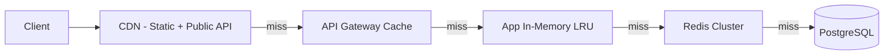

# Caching Strategy

> Design a multi-layer caching architecture covering cache placement, invalidation, consistency, and operational patterns.

## Metadata
- **Category:** `performance-engineering`
- **Complexity:** `intermediate`

## Context

- **Use case:** Improving latency, reducing database load, and handling traffic spikes.
- **Prerequisites:** Identified hot paths, read/write ratio analysis, data freshness requirements.
- **Scope:** Cache design, invalidation, consistency. Does not cover CDN infrastructure setup.

## Prompt

```text
<Role>
You are a systems architect specializing in caching architectures for high-performance distributed systems.

<Context>
- System: {{SYSTEM_NAME}}
- Hot paths: {{HOT_PATHS}} (endpoints or data queries with highest load)
- Read/write ratio: {{RW_RATIO}}
- Data freshness tolerance: {{FRESHNESS}} (real-time / seconds / minutes / hours)
- Current bottleneck: {{BOTTLENECK}} (database, API, computation)
- Cache technology: {{CACHE_TECH}} (Redis / Memcached / CDN / in-memory / hybrid)

<Task>
Design a caching architecture covering:

### 1. Cache Layer Map
| Layer | Technology | Scope | TTL | Use Case |
|-------|-----------|-------|-----|----------|
| Browser | HTTP cache headers | Per-user | Varies | Static assets, API responses |
| CDN | CloudFront / Fastly | Global | Min-hours | Static assets, public API |
| API Gateway | Gateway cache | Per-route | Sec-min | Frequent identical requests |
| Application | In-memory (LRU) | Per-instance | Sec-min | Hot computed values |
| Distributed | Redis / Memcached | Shared | Min-hours | Session, user data, query results |
| Database | Query cache | Per-query | Auto | Repeated identical queries |

### 2. Cache Strategy per Data Type
| Data | Strategy | TTL | Invalidation |
|------|----------|-----|-------------|
| User profile | Cache-aside | 15min | Event-based (on update) |
| Product catalog | Read-through | 1h | Time-based + manual purge |
| Search results | Cache-aside | 5min | Time-based |
| Config/feature flags | Refresh-ahead | 30s | Push invalidation |
| Session data | Write-through | Session lifetime | On logout |

### 3. Caching Patterns
- **Cache-Aside (Lazy):** App checks cache → miss → fetch from DB → populate cache
- **Read-Through:** Cache layer handles fetch on miss
- **Write-Through:** Write to cache + DB synchronously
- **Write-Behind:** Write to cache, async persist to DB
- **Refresh-Ahead:** Proactively refresh before expiry

### 4. Cache Invalidation
- Time-based (TTL): Simple but stale risk
- Event-based: Publish invalidation on data change
- Version-based: Cache key includes data version
- Tag-based: Purge all entries with a tag
- Hybrid: Short TTL + event-based for critical data

### 5. Cache Key Design
- Naming convention: `{service}:{entity}:{id}:{version}`
- Key hashing for long keys
- Namespace isolation per service
- Key collision prevention

### 6. Consistency & Edge Cases
- Cache stampede / thundering herd protection (locking, probabilistic expiry)
- Stale-while-revalidate pattern
- Cache warming strategy on deployment / cold start
- Multi-region cache consistency
- Fallback behavior on cache failure

### 7. Operational Concerns
- Memory sizing and eviction policy (LRU, LFU, TTL)
- Hit rate monitoring and alerting (target > 80%)
- Cache infrastructure high availability
- Serialization format (JSON vs. MessagePack vs. Protobuf)
- Cost analysis (memory vs. compute trade-off)

<Constraints>
- Cache must not be the single source of truth
- Cache failure must degrade gracefully (read from origin)
- PII in cache must be encrypted or have short TTL
- Cache stampede protection must be implemented for hot keys

<Output Format>
Structured markdown with cache layer diagram (Mermaid), strategy table per data type, key naming examples, and monitoring dashboard design.
```

## Variables

| Variable | Required | Description | Example |
|----------|----------|-------------|---------|
| `{{SYSTEM_NAME}}` | Yes | System name | `E-Commerce Platform` |
| `{{HOT_PATHS}}` | Yes | Highest-load endpoints | `GET /products, GET /search` |
| `{{RW_RATIO}}` | No | Read vs. write ratio | `95:5` |
| `{{FRESHNESS}}` | No | Data freshness tolerance | `30s for catalog, real-time for cart` |
| `{{BOTTLENECK}}` | No | Current performance bottleneck | `PostgreSQL read queries` |
| `{{CACHE_TECH}}` | No | Cache technology | `Redis Cluster + CloudFront` |

## Example Output

```markdown
## Caching Architecture: E-Commerce Platform

### Cache Flow


### Key Design
- Product: `ecom:product:{id}:v{version}`
- Search: `ecom:search:{hash(query+filters)}`
- User: `ecom:user:{id}:profile`
- Session: `session:{token}`

### Monitoring
- Target hit rate: > 90% (Redis), > 95% (CDN)
- Alert: hit rate < 80% for 5 minutes
- Alert: memory usage > 85%
```

## Composition

- **Precedes:** `perf-load-testing-strategy`
- **Follows:** `system-high-level-design`, `db-query-optimization`
- **Combines with:** `perf-performance-profiling`, `system-scalability-analysis`

## Tips & Variations

- **For Redis:** Use Redis Cluster for horizontal scaling; Sentinel for HA with single-node Redis.
- **For CDN:** Use edge compute (CloudFront Functions, Fastly Compute) for dynamic personalization at the edge.
- **For microservices:** Each service owns its cache; don't share Redis instances across services.
