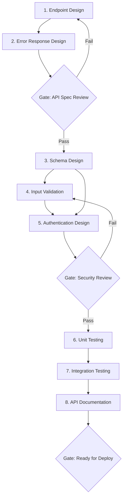

# Workflow: API Development

> End-to-end workflow for designing, implementing, securing, and deploying a REST API.

## Steps

## Step Details

### Step 1: Endpoint Design
- **Prompt:** `api-rest-endpoint-design`
- **Input:** Business requirements, resource model
- **Output:** Route table, HTTP methods, request/response schemas
- **Overlay:** Apply technology overlay (dotnet / node / python / java)

### Step 2: Error Response Design
- **Prompt:** `api-rest-error-response`
- **Input:** Output from Step 1
- **Output:** Error taxonomy, RFC 7807 response format, error codes

### Gate 1: API Spec Review
- [ ] All endpoints follow REST conventions
- [ ] Error responses use RFC 7807
- [ ] Pagination is included for list endpoints
- [ ] Versioning strategy defined
- [ ] OpenAPI spec is generated/reviewed

### Step 3: Database Schema Design
- **Prompt:** `db-schema-design`
- **Input:** Resource model from Step 1
- **Output:** Table definitions, relationships, indexes
- **Overlay:** Apply technology overlay

### Step 4: Input Validation
- **Prompt:** `security-input-validation`
- **Input:** Request schemas from Step 1
- **Output:** Validation rules, sanitization strategy

### Step 5: Authentication Design
- **Prompt:** `security-authentication-design`
- **Input:** API security requirements
- **Output:** Auth flow, token strategy, RBAC design

### Gate 2: Security Review
- [ ] All endpoints have proper authentication
- [ ] Input validation covers injection attacks
- [ ] Rate limiting is configured
- [ ] CORS policy is defined
- [ ] Secrets are managed properly

### Step 6: Unit Testing
- **Prompt:** `testing-unit`
- **Input:** Endpoint implementations
- **Output:** Test plan, test cases, mocking strategy
- **Overlay:** Apply technology overlay

### Step 7: Integration Testing
- **Prompt:** `testing-integration`
- **Input:** Full API + database
- **Output:** Integration test suite, test data strategy

### Step 8: API Documentation
- **Prompt:** `docs-api`
- **Input:** OpenAPI spec, auth details
- **Output:** Developer portal content, usage examples

### Gate 3: Ready for Deploy
- [ ] All tests passing (unit + integration)
- [ ] API documentation complete
- [ ] Performance baseline established
- [ ] Security review passed
- [ ] Monitoring and alerting configured

## Total Prompts Used
8 base prompts + 1 technology overlay = 9 prompt executions

## Estimated Duration
2-4 hours for a standard CRUD API with 5-10 endpoints.
