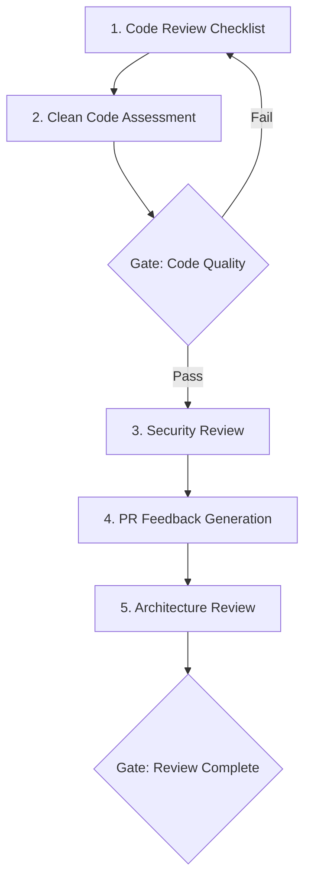

# Workflow: Code Review

> Structured code review workflow combining automated checks, manual review, and architecture assessment.

## Steps

## Step Details

### Step 1: Code Review Checklist
- **Prompt:** `review-checklist`
- **Input:** Pull request diff, changed files
- **Output:** Completed checklist covering correctness, style, performance, security

### Step 2: Clean Code Assessment
- **Prompt:** `coding-clean-code-principles` + `coding-solid-principles` + `coding-dry-kiss`
- **Input:** Changed files from PR
- **Output:** Code quality findings, naming issues, complexity concerns, refactoring suggestions

### Gate 1: Code Quality
- [ ] No critical code smells
- [ ] Naming is clear and consistent
- [ ] Functions/methods have single responsibility
- [ ] No unnecessary complexity
- [ ] Error handling is appropriate

### Step 3: Security Review
- **Prompt:** `security-owasp-top-10` + `security-input-validation`
- **Input:** Changed files, especially controllers, data access, auth flows
- **Output:** Security findings, injection risks, auth issues, data exposure concerns

### Step 4: PR Feedback Generation
- **Prompt:** `review-pr-feedback`
- **Input:** Findings from Steps 1-3
- **Output:** Structured PR review comments with severity, suggestions, and code examples

### Step 5: Architecture Review
- **Prompt:** `review-architecture`
- **Input:** Overall PR scope, system context
- **Output:** Architecture impact assessment, dependency analysis, pattern compliance check
- **Note:** Only needed for PRs that change component boundaries, add dependencies, or modify public APIs

### Gate 2: Review Complete
- [ ] All critical and high findings addressed
- [ ] Security review passed
- [ ] Architecture impact assessed (if applicable)
- [ ] PR feedback posted

## Total Prompts Used
5-7 base prompts across 5 steps

## Estimated Duration
30-90 minutes per PR depending on scope.
