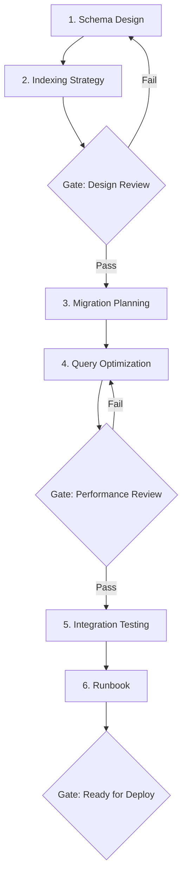

# Workflow: Database Change

> End-to-end workflow for designing, validating, migrating, and optimizing database changes.

## Steps

## Step Details

### Step 1: Schema Design
- **Prompt:** `db-schema-design`
- **Input:** Business requirements, entity-relationship model, data volume estimates
- **Output:** Table definitions, relationships, constraints, data types
- **Overlay:** Apply technology overlay (dotnet / node / python / java)

### Step 2: Indexing Strategy
- **Prompt:** `db-indexing-strategy`
- **Input:** Schema from Step 1, query access patterns
- **Output:** Index definitions, covering indexes, partial indexes, index maintenance plan

### Gate 1: Design Review
- [ ] Schema is in 3NF (or justified denormalization documented)
- [ ] All foreign keys have indexes
- [ ] Column types are appropriate for data size and query patterns
- [ ] Naming conventions followed (per `naming-database`)
- [ ] Estimated storage and row counts documented

### Step 3: Migration Planning
- **Prompt:** `db-migration-planning`
- **Input:** Current schema (if existing), target schema from Step 1
- **Output:** Migration scripts, rollback scripts, data backfill plan, zero-downtime strategy

### Gate 1b: Migration Safety
- [ ] Migration is backward-compatible (expand-then-contract)
- [ ] Rollback script tested
- [ ] Large table migrations use batched approach
- [ ] Estimated migration duration documented

### Step 4: Query Optimization
- **Prompt:** `db-query-optimization`
- **Input:** Critical queries, execution plans, index strategy from Step 2
- **Output:** Optimized queries, EXPLAIN analysis, caching recommendations

### Gate 2: Performance Review
- [ ] All critical queries use indexes (no full table scans)
- [ ] Query execution time within SLA (< 100ms for OLTP, < 5s for reporting)
- [ ] N+1 query patterns eliminated
- [ ] Connection pooling configured

### Step 5: Integration Testing
- **Prompt:** `testing-integration`
- **Input:** Schema, migrations, optimized queries
- **Output:** Database integration test suite, test data seeding, cleanup strategy
- **Focus:** Migration up/down, constraint validation, concurrent access

### Step 6: Deployment Runbook
- **Prompt:** `docs-runbook`
- **Input:** All previous outputs
- **Output:** Step-by-step deployment runbook with pre/post validation checks

### Gate 3: Ready for Deploy
- [ ] Migration tested in staging environment
- [ ] Rollback procedure documented and tested
- [ ] Performance benchmarks pass
- [ ] Monitoring alerts configured for query latency and connection pool
- [ ] Backup taken before migration window

## Tips
- For large tables (>10M rows): Run migration during low-traffic window with progress monitoring.
- For multi-service databases: Coordinate migration order with dependent service teams.
- Always use expand-then-contract: add new column → backfill → migrate reads → drop old column.
