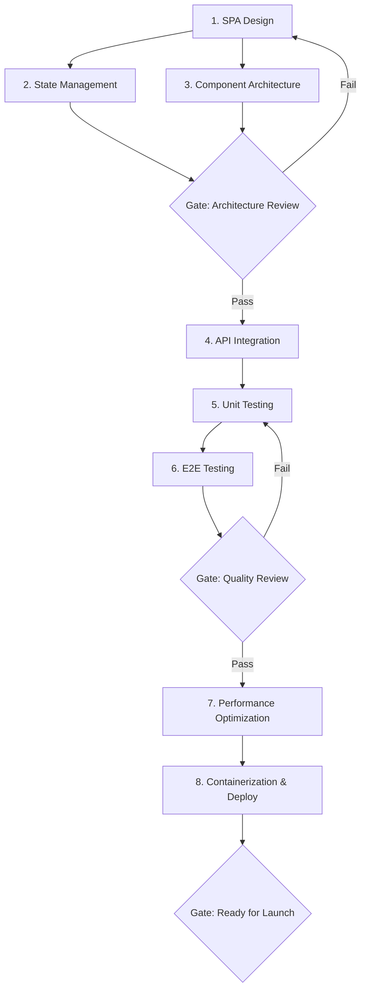

# Workflow: Frontend Development

> End-to-end workflow for designing, building, testing, and deploying a frontend application.

## Steps

## Step Details

### Step 1: SPA Design
- **Prompt:** `frontend-spa-design`
- **Input:** Product requirements, wireframes, target platforms
- **Output:** Application architecture, rendering strategy (CSR/SSR/SSG), routing plan
- **Overlay:** Apply framework overlay (react / angular / vue)

### Step 2: State Management
- **Prompt:** `frontend-state-management`
- **Input:** SPA design from Step 1, data flow requirements
- **Output:** State architecture (client vs. server state), store design, caching strategy

### Step 3: Component Architecture
- **Prompt:** `frontend-component-architecture` (from 12-frontend-architecture)
- **Input:** Wireframes, design system tokens
- **Output:** Component hierarchy, compound component patterns, design system primitives

### Gate 1: Architecture Review
- [ ] Rendering strategy justified (SSR for SEO, CSR for dashboards)
- [ ] State management separates server state from UI state
- [ ] Component tree avoids prop drilling (max 3 levels)
- [ ] Bundle splitting strategy defined (route-based + lazy)
- [ ] Accessibility plan documented (WCAG 2.1 AA)

### Step 4: API Integration
- **Prompt:** `api-rest-endpoint-design` or `graphql-schema-design`
- **Input:** Backend API contracts, authentication mechanism
- **Output:** API client setup, typed request/response models, error handling
- **Overlay:** Apply framework-specific data fetching patterns

### Step 5: Unit Testing
- **Prompt:** `testing-unit`
- **Input:** Components, hooks/composables, state logic
- **Output:** Unit test suite, component tests, mock strategy
- **Focus:** Test behavior, not implementation; render → interact → assert

### Step 6: E2E Testing
- **Prompt:** `testing-e2e`
- **Input:** User flows, critical paths
- **Output:** E2E test suite (Playwright/Cypress), CI integration, visual regression setup

### Gate 2: Quality Review
- [ ] Unit test coverage ≥ 80% for business logic
- [ ] E2E tests cover all critical user flows
- [ ] No accessibility violations (axe-core audit)
- [ ] No console errors or unhandled promise rejections
- [ ] Error boundaries handle all failure modes gracefully

### Step 7: Performance Optimization
- **Prompt:** `perf-load-testing` + `perf-caching-strategy` (from 14-performance-engineering)
- **Input:** Bundle analysis, Lighthouse audit, Core Web Vitals baseline
- **Output:** Optimization plan (code splitting, image optimization, caching headers)
- **Targets:** LCP < 2.5s, FID < 100ms, CLS < 0.1

### Step 8: Containerization & Deployment
- **Prompt:** `devops-containerization`
- **Input:** Built application, CDN requirements, environment config
- **Output:** Dockerfile (multi-stage), Nginx/Caddy config, CDN setup, environment variable injection

### Gate 3: Ready for Launch
- [ ] Lighthouse performance score ≥ 90
- [ ] All Core Web Vitals in "Good" range
- [ ] CSP headers configured
- [ ] Error monitoring integrated (Sentry / Application Insights)
- [ ] Feature flags ready for gradual rollout
- [ ] CDN cache invalidation documented

## Tips
- For SSR frameworks (Next.js, Nuxt, Analog): Run Steps 1-3 with the framework overlay for SSR-specific patterns.
- For micro-frontends: Add a micro-frontend composition step after Step 3 using `frontend-micro-frontends`.
- For PWA: Add a PWA enhancement step using `frontend-pwa-optimization` after Step 7.
