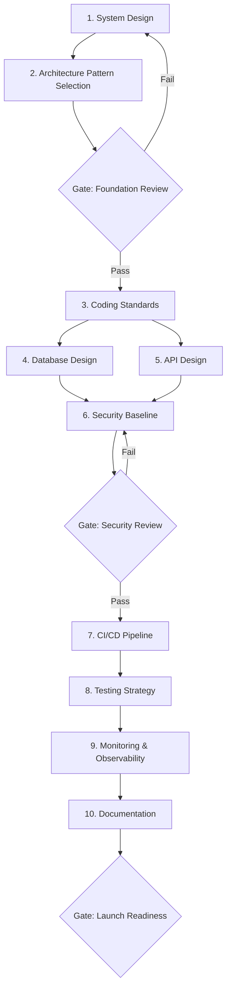

# Workflow: Greenfield Project

> End-to-end workflow for starting a new project from scratch — covers architecture, coding standards, CI/CD, security, testing, and documentation foundations.

## Steps

## Step Details

### Step 1: System Design
- **Prompt:** `system-high-level-design` + `system-low-level-design`
- **Input:** Product requirements, team size, timeline, budget constraints
- **Output:** Architecture diagrams, component boundaries, data flow

### Step 2: Architecture Pattern Selection
- **Prompt:** `arch-microservices-design` or `arch-clean-hexagonal-architecture`
- **Input:** System design from Step 1, team expertise, operational maturity
- **Output:** Selected architecture pattern with justification (ADR)

### Gate 1: Foundation Review
- [ ] Architecture pattern fits team capabilities
- [ ] Component boundaries are clear
- [ ] Communication patterns are defined
- [ ] Technology stack is finalized

### Step 3: Coding Standards
- **Prompt:** `coding-clean-code-principles` + `coding-solid-principles` + `naming-general-guide`
- **Input:** Selected technology stack
- **Output:** Coding guidelines, naming conventions, linting configuration
- **Overlay:** Apply technology overlay (e.g., `overlays/dotnet/`, `overlays/node/`)

### Step 4: Database Design (Parallel with Step 5)
- **Prompt:** `db-schema-design` + `db-indexing-strategy` + `db-migration-planning`
- **Input:** Data model from Step 1
- **Output:** Schema, indexes, migration strategy, seed data plan

### Step 5: API Design (Parallel with Step 4)
- **Prompt:** `api-rest-endpoint-design` + `api-rest-versioning` + `api-rest-pagination-filtering`
- **Input:** Component interfaces from Step 2
- **Output:** Full API specification with versioning, pagination, error handling

### Step 6: Security Baseline
- **Prompt:** `security-owasp-top-10` + `security-authentication-design` + `security-input-validation` + `security-secrets-management`
- **Input:** All outputs from Steps 1-5
- **Output:** Security architecture, auth flow, input validation rules, secrets strategy

### Gate 2: Security Review
- [ ] Authentication and authorization designed
- [ ] OWASP Top 10 risks addressed
- [ ] Input validation strategy complete
- [ ] Secrets management plan in place
- [ ] API security requirements met

### Step 7: CI/CD Pipeline
- **Prompt:** `devops-cicd-pipeline` + `devops-containerization`
- **Input:** Technology stack, deployment targets
- **Output:** Pipeline definition, Dockerfile, build/test/deploy stages

### Step 8: Testing Strategy
- **Prompt:** `testing-unit` + `testing-integration` + `testing-e2e` + `testing-tdd-workflow`
- **Input:** Architecture, API specs, component boundaries
- **Output:** Test pyramid, coverage targets, test infrastructure setup

### Step 9: Monitoring & Observability
- **Prompt:** `devops-monitoring-observability`
- **Input:** Architecture, SLIs/SLOs from requirements
- **Output:** Logging strategy, metrics, alerting rules, dashboards

### Step 10: Documentation
- **Prompt:** `docs-adr` + `docs-api` + `docs-runbook`
- **Input:** All outputs from Steps 1-9
- **Output:** ADRs for all decisions, API docs, operational runbook

### Gate 3: Launch Readiness
- [ ] All ADRs documented
- [ ] CI/CD pipeline operational
- [ ] Test coverage meets target (80%+)
- [ ] Monitoring and alerting configured
- [ ] Runbook covers incident response
- [ ] Security review passed

## Total Prompts Used
18-22 base prompts across 10 steps

## Estimated Duration
8-16 hours for a medium-complexity project setup.
