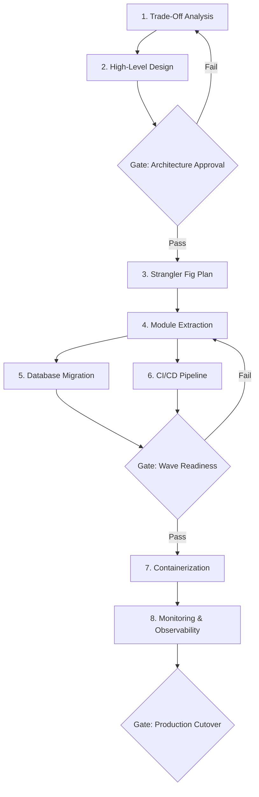

# Workflow: Migration (Legacy Modernization)

> End-to-end workflow for incrementally migrating a legacy system to a modern architecture using the Strangler Fig pattern.

## Steps

## Step Details

### Step 1: Trade-Off Analysis
- **Prompt:** `system-trade-off-analysis`
- **Input:** Legacy system description, business drivers, constraints
- **Output:** Migration vs. rewrite vs. maintain decision matrix, risk assessment

### Step 2: High-Level Design (Target)
- **Prompt:** `system-high-level-design`
- **Input:** Trade-off analysis output, target architecture goals
- **Output:** Target architecture diagram, service boundaries, technology stack selection

### Gate 1: Architecture Approval
- [ ] Target architecture addresses all migration drivers
- [ ] Risk mitigation plan for each identified risk
- [ ] Team skill gaps identified with training plan
- [ ] Budget and timeline approved
- [ ] Rollback strategy defined for each migration wave

### Step 3: Strangler Fig Plan
- **Prompt:** `arch-strangler-fig`
- **Input:** Legacy system analysis, target architecture from Step 2
- **Output:** Feature extraction sequence, routing facade design, wave timeline, data migration strategy

### Step 4: Module Extraction (Per Wave)
- **Prompt:** `arch-microservices-design` or `arch-modular-monolith`
- **Input:** Feature scope for current wave, legacy code analysis
- **Output:** New service/module design, anti-corruption layer, API contracts
- **Overlay:** Apply technology overlay for target stack

### Step 5: Database Migration
- **Prompt:** `db-migration-planning`
- **Input:** Legacy schema, target schema, data volume
- **Output:** Schema migration scripts, CDC setup, data synchronization plan, reconciliation queries

### Step 6: CI/CD Pipeline
- **Prompt:** `devops-cicd-pipeline`
- **Input:** New service from Step 4, deployment targets
- **Output:** Build pipeline, deployment pipeline, schema composition checks (if federated)

### Gate 2: Wave Readiness
- [ ] New service passes all integration tests
- [ ] Data synchronization validated (legacy ↔ new)
- [ ] Performance benchmarks meet SLA
- [ ] Shadow traffic / dark launch validated
- [ ] Routing facade configured for canary deployment
- [ ] Rollback procedure documented and rehearsed

### Step 7: Containerization & Deployment
- **Prompt:** `devops-containerization`
- **Input:** New service from Step 4
- **Output:** Dockerfile, Kubernetes manifests, health/readiness probes, resource limits

### Step 8: Monitoring & Observability
- **Prompt:** `devops-monitoring-observability`
- **Input:** All services (legacy + new), routing facade
- **Output:** Dashboard, alerts, distributed tracing, SLI/SLO definitions

### Gate 3: Production Cutover
- [ ] Canary deployment stable for N days (configurable)
- [ ] Error rate ≤ legacy baseline
- [ ] Latency ≤ legacy baseline + 10%
- [ ] All legacy traffic routed to new service
- [ ] Legacy code path marked for decommission
- [ ] Data reconciliation passes 100%

## Repeat Per Wave
Steps 4–8 and Gates 2–3 repeat for each migration wave until the legacy system is fully decommissioned.

## Tips
- Start with the lowest-risk, highest-independence module to build migration confidence.
- Run legacy and new systems in parallel for at least 2 weeks before decommissioning legacy paths.
- Automate data reconciliation — manual comparison does not scale.
