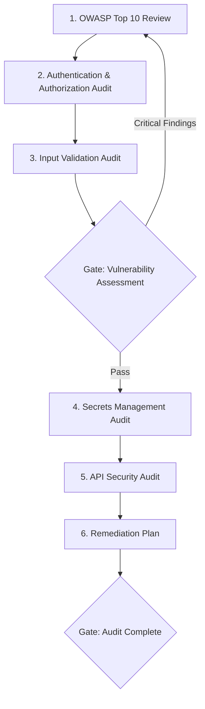

# Workflow: Security Audit

> Comprehensive security audit workflow from threat modeling through remediation verification.

## Steps

## Step Details

### Step 1: OWASP Top 10 Review
- **Prompt:** `security-owasp-top-10`
- **Input:** Application codebase, architecture diagrams, deployment configuration
- **Output:** Findings mapped to OWASP Top 10 categories with severity ratings

### Step 2: Authentication & Authorization Audit
- **Prompt:** `security-authentication-design`
- **Input:** Auth flows, token handling, session management, RBAC/ABAC config
- **Output:** Auth vulnerability findings, session security issues, privilege escalation risks

### Step 3: Input Validation Audit
- **Prompt:** `security-input-validation`
- **Input:** All user-facing endpoints, form handlers, file upload handlers, query parameters
- **Output:** Injection risks (SQL, XSS, command), validation gaps, encoding issues

### Gate 1: Vulnerability Assessment
- [ ] No critical (CVSS 9.0+) vulnerabilities unaddressed
- [ ] All injection vectors identified
- [ ] Authentication bypass risks assessed
- [ ] Broken access control scenarios tested

### Step 4: Secrets Management Audit
- **Prompt:** `security-secrets-management`
- **Input:** Configuration files, environment setup, CI/CD pipelines, deployment scripts
- **Output:** Exposed secrets, insecure storage, rotation gaps, vault configuration issues

### Step 5: API Security Audit
- **Prompt:** `api-rest-security`
- **Input:** API endpoints, rate limiting config, CORS settings, API keys/tokens
- **Output:** API-specific vulnerabilities, rate limiting gaps, CORS misconfigurations, broken object-level authorization

### Step 6: Remediation Plan
- **Input:** All findings from Steps 1-5
- **Output:** Prioritized remediation backlog with:
  - Severity classification (Critical / High / Medium / Low)
  - Effort estimates per finding
  - Suggested fix patterns referencing relevant prompts
  - Verification criteria for each fix

### Gate 2: Audit Complete
- [ ] All findings documented with severity
- [ ] Remediation plan covers all critical and high findings
- [ ] Timeline established for remediation
- [ ] Re-audit date scheduled
- [ ] Compliance requirements verified (if applicable)

## Total Prompts Used
5-6 base prompts across 6 steps

## Estimated Duration
2-4 hours for a medium-complexity application.
