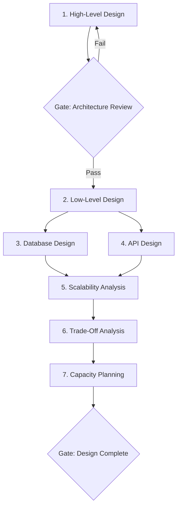

# Workflow: System Design

> Full system design workflow from requirements gathering through capacity planning and trade-off analysis.

## Steps

## Step Details

### Step 1: High-Level Design
- **Prompt:** `system-high-level-design`
- **Input:** Business requirements, constraints, non-functional requirements
- **Output:** System context diagram, component diagram, data flow, technology selection

### Gate 1: Architecture Review
- [ ] All functional requirements addressed
- [ ] Non-functional requirements have quantitative targets
- [ ] Component boundaries are well-defined
- [ ] Data flow is clear and complete
- [ ] Technology choices are justified

### Step 2: Low-Level Design
- **Prompt:** `system-low-level-design`
- **Input:** High-level design from Step 1
- **Output:** Class diagrams, sequence diagrams, API contracts, detailed component design

### Step 3: Database Design (Parallel with Step 4)
- **Prompt:** `db-schema-design` + `db-indexing-strategy`
- **Input:** Data model from Steps 1-2
- **Output:** Schema, indexes, migration plan

### Step 4: API Design (Parallel with Step 3)
- **Prompt:** `api-rest-endpoint-design` + `api-rest-error-response`
- **Input:** Component interfaces from Step 2
- **Output:** API specification, error handling, versioning

### Step 5: Scalability Analysis
- **Prompt:** `system-scalability-analysis`
- **Input:** All outputs from Steps 1-4
- **Output:** Scaling strategy, bottleneck identification, horizontal/vertical scaling plan

### Step 6: Trade-Off Analysis
- **Prompt:** `system-trade-off-analysis`
- **Input:** Design decisions and alternatives from all previous steps
- **Output:** Trade-off matrix, decision records (ADRs)

### Step 7: Capacity Planning
- **Prompt:** `system-capacity-planning`
- **Input:** Traffic estimates, scalability analysis
- **Output:** Resource sizing, cost estimates, growth projections

### Gate 2: Design Complete
- [ ] All components have detailed designs
- [ ] Database schema supports all use cases
- [ ] APIs are fully specified
- [ ] Scaling strategy addresses NFRs
- [ ] Trade-offs are documented as ADRs
- [ ] Capacity plan fits budget constraints

## Total Prompts Used
7-9 base prompts across 7 steps

## Estimated Duration
3-6 hours for a medium-complexity distributed system.
